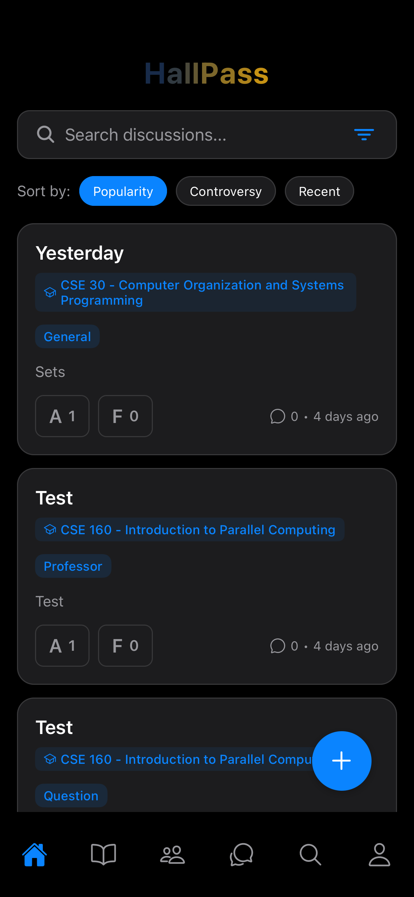
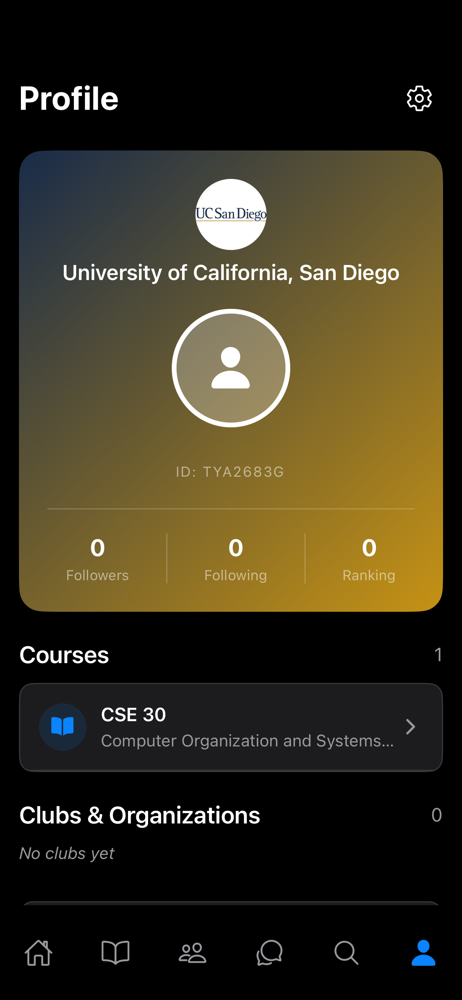

# HallPass

A cross-platform mobile application that combines the best of Reddit and Instagram, tailored specifically for university communities. HallPass enables students to connect, discuss courses, join clubs, rate professors, and engage with their campus community in a private, university-specific environment.

## Features

### 🏠 Bulletin (Home Tab)
- University-branded feed with discussions
- Filter by topics, courses, professors, or organizations
- Create discussions with tags and associations
- Upvote (A) or Downvote (F) posts
- Sort by popularity or controversy
- ML-powered ranking system

### 📚 Course Tab
- Browse and search courses
- Filter by enrolled courses or interests
- Rate professors on:
  - Hardness
  - Coursework
  - Communication
  - Enjoyment
- Access private course sessions (for enrolled students)
- Course-specific discussion boards

### 👥 Clubs Tab
- Discover university clubs and organizations
- Club-specific pages and discussions
- Rate clubs on engagement, community, events, and overall experience
- Join and participate in club activities

### 💬 Message Tab
- Private messaging between users
- Real-time conversations
- Message clubs and organizations

### 🔍 Search Tab
- Search for users, clubs, and courses
- Access associated discussion boards
- Quick navigation to profiles and details

### 👤 User Tab
- Beautiful ID card design with university branding
- Display courses, clubs, and discussion rankings
- Follow/unfollow system
- Public/private account settings
- Share profile via unique ID or share button

### 🎨 Design Features
- Light/Dark mode (defaults to device preference)
- Instagram-like soft edge design with bubbles
- University color scheme integration
- Minimalistic yet informative UI

## Tech Stack

- **Framework**: React Native with Expo
- **Language**: TypeScript
- **Navigation**: React Navigation (Bottom Tabs + Stack)
- **Backend**: Firebase (Authentication, Firestore)
- **Image Storage**: AWS S3 (free tier: 5GB storage, 20K GET requests/month)
- **State Management**: React Context API
- **ML Integration**: TensorFlow.js (ready for custom models)
- **UI Components**: React Native Paper, Custom Components

## Key Features

### Onboarding Survey
- Multi-step form for initial setup
- University selection with logos
- Course and club selection
- Optional first action prompt

### Discussion System
- Create discussions with title, content, tags
- Associate with courses, professors, or clubs
- Voting system (A for upvote, F for downvote)
- Comments and replies
- ML-powered ranking and sorting

### Private Course Sessions
- Only visible to enrolled students
- Set during course enrollment or quarter start
- Separate discussion space for course-specific topics

### Duplicate Detection
- When users submit courses/professors/clubs
- Multiple submissions with similar names trigger review
- Threshold-based automatic addition (no duplicates)

### Profile ID Card
- Vertical card design
- University colors and logo
- User stats (followers, following, ranking)
- Courses and clubs display
- Share functionality

## Database Schema

### User Document
```typescript
{
  id: string;
  email: string;
  name: string;
  username?: string;
  profileImage?: string;
  university: string; // University ID
  courses: string[]; // Course IDs
  clubs: string[]; // Club IDs
  followers: string[]; // User IDs
  following: string[]; // User IDs
  discussionRanking: number;
  isPrivate: boolean;
  createdAt: Date;
  updatedAt: Date;
}
```

### Discussion Document
```typescript
{
  id: string;
  userId: string;
  title: string;
  content: string;
  images?: string[];
  tags: string[];
  courseId?: string;
  professorId?: string;
  clubId?: string;
  organizationId?: string;
  upvotes: string[]; // User IDs
  downvotes: string[]; // User IDs
  comments: Comment[];
  score: number;
  controversy: number;
  createdAt: Date;
  updatedAt: Date;
  isPrivate?: boolean; // For course sessions
  enrolledUsers?: string[]; // For course sessions
}
```

### Course Document
```typescript
{
  id: string;
  code: string;
  name: string;
  description?: string;
  universityId: string;
  professors: string[]; // Professor IDs
  createdAt: Date;
}
```

### Professor Document
```typescript
{
  id: string;
  name: string;
  email?: string;
  courses: string[]; // Course IDs
  averageRating: {
    hardness: number;
    coursework: number;
    communication: number;
    enjoyment: number;
  };
}
```

### Club Document
```typescript
{
  id: string;
  name: string;
  description?: string;
  image?: string;
  universityId: string;
  members: string[]; // User IDs
  averageRating: {
    engagement: number;
    community: number;
    events: number;
    overall: number;
  };
  createdAt: Date;
}
```

## ML Model Integration

The app includes integration points for ML models in `src/services/mlService.ts`. Currently, it uses heuristic-based ranking, but you can replace it with:

- **TensorFlow.js** (Client-side)
- **Backend ML Service** (API-based)
- **Firebase Cloud Functions**

### Current ML Features:
- **Discussion Ranking**: Combines votes, comments, time decay, and user ranking
- **Controversy Score**: Calculates based on upvote/downvote ratio
- **User Ranking**: Based on posts, votes, comments, and followers
- **Duplicate Detection**: Text similarity for courses/professors/clubs
- **Personalized Recommendations**: Based on user interests, courses, and clubs

## Project Structure

```
hallpass/
├── src/
│   ├── components/          # Reusable components
│   ├── config/              # Configuration files
│   ├── context/             # React Context providers
│   ├── navigation/           # Navigation setup
│   ├── screens/              # Screen components
│   ├── services/             # Business logic services
│   ├── types/                # TypeScript type definitions
│   └── App.tsx               # Main app component
├── assets/                   # Images, fonts, etc.
├── app.json                  # Expo configuration
├── package.json              # Dependencies
├── tsconfig.json             # TypeScript configuration
├── README.md                 # This file
└── SETUP.md                  # Setup instructions
```

## Getting Started

See [SETUP.md](./SETUP.md) for complete setup and build instructions.

## Future Enhancements

- [ ] Push notifications for messages and mentions
- [ ] Advanced search with filters
- [ ] Real-time discussion updates
- [ ] Analytics and insights
- [ ] Admin panel for university management
- [ ] Integration with university systems
- [ ] Advanced ML models for content moderation
- [ ] Video support for discussions

## Samples






## License

This project is licensed under the MIT License.

## Acknowledgments

- Inspired by Reddit, Instagram, and YikYak
- Built with React Native and Expo
- Powered by Firebase and AWS
