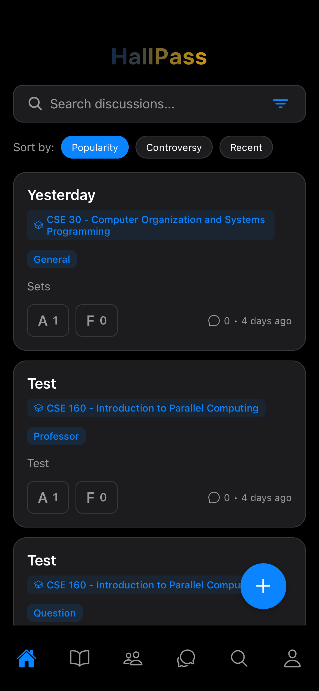
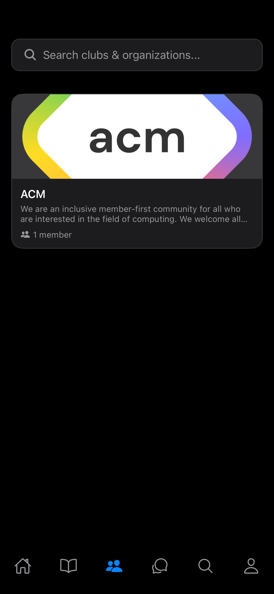
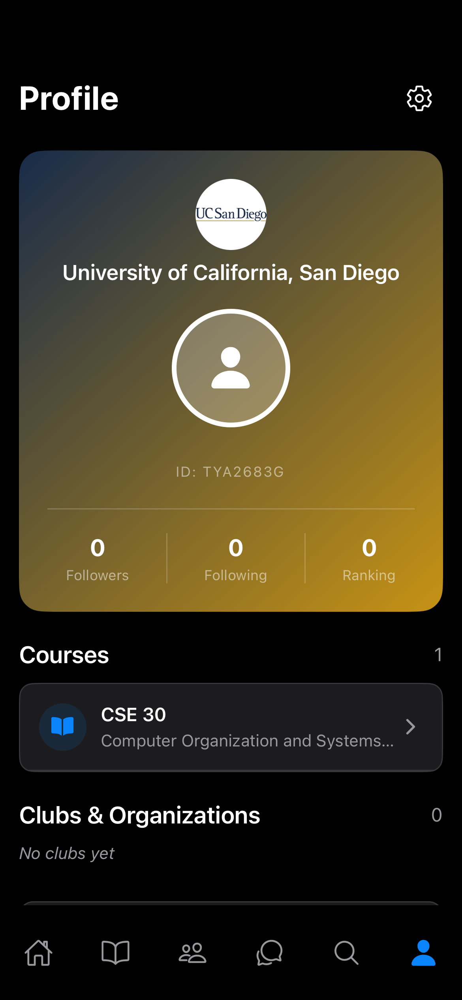
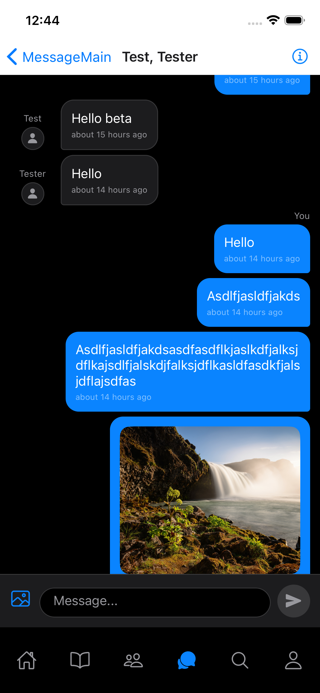
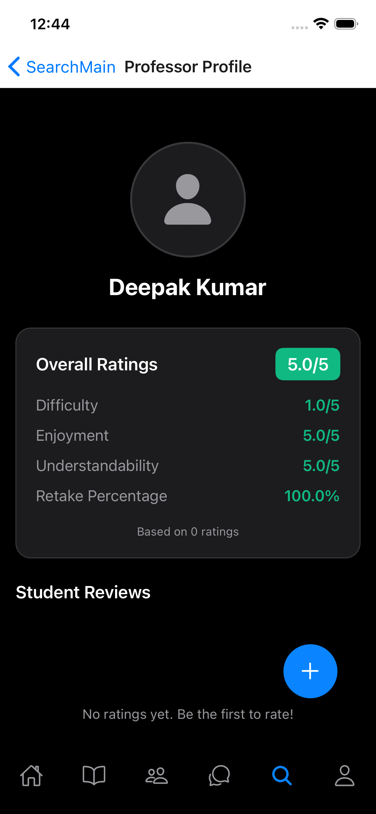

# HallPass

A cross-platform mobile application that combines the best of Reddit and Instagram, tailored specifically for university communities. HallPass enables students to connect, discuss courses, join clubs, rate professors, and engage with their campus community in a private, university-specific environment.

## Features

### 🏠 Bulletin + Notifications
- University feed with course, club, and campus-wide threads
- Sort by popularity, controversy, or recency using ML-assisted ranking
- Create discussions with tags and optional course/club/professor context
- Dedicated notifications view for:
  - Incoming follow requests (accept/decline)
  - Trending discussions in your courses and organizations

### 📚 Course Experience
- Browse and search university courses
- Course detail tabs for discussions, private discussions, professors, and members
- Private course discussions for enrolled students only
- Professor profiles with ratings and review flow
- "Request Add Professor" flow directly from course pages

### 👥 Clubs and Organizations
- Discover campus organizations and clubs
- Organization detail pages with discussions and membership context
- Club rating dimensions: engagement, community, events, overall

### 💬 Messaging
- 1:1 and group chats
- Message requests (accept or delete) before opening a conversation
- Conversation controls: mute/unmute, hide for yourself, or delete
- Chat settings with:
  - Rename chat
  - Change group icon image
  - Add or remove participants
  - Shared media and link history with search
- Message tab unread badge support

### 🔍 Search + Profiles
- Search users, courses, clubs, and professors
- Jump directly to detail pages and discussion contexts
- Profile system with follow/unfollow and private-account request handling
- User card with university branding, ranking, and activity context

### 🎨 Design System
- Light, dark, and auto theme modes
- University color integration across views
- Mobile-first card-based UI built with Expo + React Native

## Tech Stack

- **Framework**: React Native with Expo
- **Language**: TypeScript
- **Navigation**: React Navigation (Bottom Tabs + Stack)
- **Backend**: Firebase (Authentication, Firestore)
- **Image Storage**: AWS S3 (free tier: 5GB storage, 20K GET requests/month)
- **State Management**: React Context API
- **ML Integration**: TensorFlow.js (ready for custom models)
- **UI Components**: React Native Paper, Custom Components

## Key Features

### Onboarding Survey
- Multi-step form for initial setup
- University selection with logos
- Course and club selection
- Optional first action prompt

### Discussion System
- Create discussions with title, content, tags
- Associate with courses, professors, or clubs
- Voting system (A for upvote, F for downvote)
- Threaded comments and replies
- ML-powered ranking and sorting

### Private Course Sessions
- Only visible to enrolled students
- Set during course enrollment or quarter start
- Separate discussion space for course-specific topics

### Duplicate Detection
- When users submit courses/professors/clubs
- Multiple submissions with similar names trigger review
- Threshold-based automatic addition (no duplicates)

### Catalog Admin + Data Pipeline
- Local admin UI (`npm run catalog:ui`) for catalog operations
- Config-driven catalog scraping (`scripts/scrape-catalog.mjs`) with:
  - Section toggles (universities, courses, organizations, professors)
  - Optional merge mode to preserve existing local catalog data
  - Dry-run mode for safe validation
- Firestore push utility (`scripts/catalog-push.mjs`) that fills missing fields without overwriting existing non-empty data

### Profile ID Card
- Vertical card design
- University colors and logo
- User stats (followers, following, ranking)
- Courses and clubs display
- Share functionality

## Database Schema

### User Document
```typescript
{
  id: string;
  email: string;
  name: string;
  username?: string;
  profileImage?: string;
  university: string; // University ID
  courses: string[]; // Course IDs
  clubs: string[]; // Club IDs
  followers: string[]; // User IDs
  following: string[]; // User IDs
  discussionRanking: number;
  isPrivate: boolean;
  createdAt: Date;
  updatedAt: Date;
}
```

### Discussion Document
```typescript
{
  id: string;
  userId: string;
  title: string;
  content: string;
  images?: string[];
  tags: string[];
  courseId?: string;
  professorId?: string;
  clubId?: string;
  organizationId?: string;
  upvotes: string[]; // User IDs
  downvotes: string[]; // User IDs
  comments: Comment[];
  score: number;
  controversy: number;
  createdAt: Date;
  updatedAt: Date;
  isPrivate?: boolean; // For course sessions
  enrolledUsers?: string[]; // For course sessions
}
```

### Course Document
```typescript
{
  id: string;
  code: string;
  name: string;
  description?: string;
  universityId: string;
  professors: string[]; // Professor IDs
  createdAt: Date;
}
```

### Professor Document
```typescript
{
  id: string;
  name: string;
  email?: string;
  courses: string[]; // Course IDs
  averageRating: {
    hardness: number;
    coursework: number;
    communication: number;
    enjoyment: number;
  };
}
```

### Club Document
```typescript
{
  id: string;
  name: string;
  description?: string;
  image?: string;
  universityId: string;
  members: string[]; // User IDs
  averageRating: {
    engagement: number;
    community: number;
    events: number;
    overall: number;
  };
  createdAt: Date;
}
```

## ML Model Integration

The app includes integration points for ML models in `src/services/mlService.ts`. Currently, it uses heuristic-based ranking, but you can replace it with:

- **TensorFlow.js** (Client-side)
- **Backend ML Service** (API-based)
- **Firebase Cloud Functions**

### Current ML Features:
- **Discussion Ranking**: Combines votes, comments, time decay, and user ranking
- **Controversy Score**: Calculates based on upvote/downvote ratio
- **User Ranking**: Based on posts, votes, comments, and followers
- **Duplicate Detection**: Text similarity for courses/professors/clubs
- **Personalized Recommendations**: Based on user interests, courses, and clubs

## Project Structure

```
hallpass/
├── src/
│   ├── components/          # Reusable components
│   ├── config/              # Configuration files
│   ├── context/             # React Context providers
│   ├── navigation/           # Navigation setup
│   ├── screens/              # Screen components
│   ├── services/             # Business logic services
│   ├── types/                # TypeScript type definitions
│   └── App.tsx               # Main app component
├── assets/                   # Images, fonts, etc.
├── app.json                  # Expo configuration
├── package.json              # Dependencies
├── tsconfig.json             # TypeScript configuration
├── README.md                 # This file
└── SETUP.md                  # Setup instructions
```

## Getting Started

See [SETUP.md](./SETUP.md) for complete setup and build instructions.

## Future Enhancements

- [ ] Push notifications for messages and mentions
- [ ] Advanced search with filters
- [ ] Analytics and insights
- [ ] Admin panel for university management
- [ ] Integration with university systems
- [ ] Advanced ML models for content moderation
- [ ] Video support for discussions

## Samples









## License

This project is licensed under the MIT License.

## Acknowledgments

- Inspired by Reddit, Instagram, and YikYak
- Built with React Native and Expo
- Powered by Firebase and AWS
